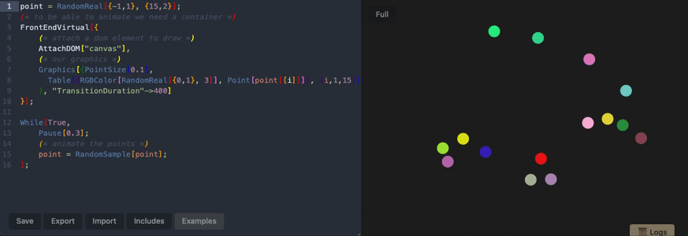

# Minimal Wolfram Language Interpreter (WLJS) 
*written with love in Javascript*



***Early Development Stage!***

## Live Demo [GithubPages](https://jerryi.github.io/wljs-interpreter/)
There are a couple of examples available. To edit WL code, one need to have Wolfram Engine or Mathematica installed, since there is no WL syntax to JSON parser written on the internet so far. Please run
```mathematica
Import["https://raw.githubusercontent.com/JerryI/tinyweb-mathematica/master/Tinyweb/Tinyweb.wl"];
server = WEBServer["addr" -> "127.0.0.1:8099", "path" -> "/", "socket-close" -> True];
server // WEBServerStart;
transpile[c_] := WebSocketSend[Global`client, ToExpression[c, InputForm, Hold]];
```
or if you wolframscript
```bash
git clone https://github.com/JerryI/wljs-interpreter
cd wljs-interpreter
wolframscript -f transpile.wls
npm i
npm start
```
and reload the page.

__This is a core component of [Wolfram JS Frontend](https://github.com/JerryI/wolfram-js-frontend) project__
but one can use it independently as well

__[Docs](https://jerryi.github.io/wljs-docs/)__

---

It includes two parts
- `interpeter.js` - a set of functions, that executes the commands and maintain binding between variables
- `core.js` - core library (support for `List`, `Rule` and etc...)

*This is not meant for heavy computations, but rather for interpreting the results produced by Wolfram Engine / Mathematica in your browser or making standalone notebooks*

*Symbolic computing is not possible*

## Extensions
This repository provides only the minimum-necessary set of functions, to bring `Graphics` and `Graphics3D` (or if you are using [Wolfram JS Frontend](https://github.com/JerryI/wolfram-js-frontend) you need set of sliders and other building blocks for GUI) you should consider to use it together with the following packages

- [wljs-graphics-d3](https://github.com/JerryI/wljs-graphics-d3)
- [wljs-graphics3d-threejs](https://github.com/JerryI/Mathematica-ThreeJS-graphics-engine)

Just simply include `dist/kernel.js` file into the web-page as a module using CDN (JSDelivr, StaticIO). Some of [build-in examples]((#examples)) already uses those packages. NO installation needed.

## Partially supported native WL expressions
There is no aim to recreate all Wolfram Language functions, you can think about this interpreter more like as a bridge between `Javascript` ecosystem and `Wolfram Language`. The interpreter can easily be expanded via packages or explicitly defined functions inside the HTML page. One can write your own symbols based on the application you have.

To check implemented function see `src/core.js`

Please, see [Docs](i still did not write them, sorry) for more information as well as [Wolfram Language JS Frontend](https://github.com/JerryI/wolfram-js-frontend) page.

__To help maintain this project [kirill.vasin@uni-a.de](https://www.paypal.com/donate/?hosted_button_id=BN9LWUUUJGW54) [PayPal](https://www.paypal.com/donate/?hosted_button_id=BN9LWUUUJGW54) Thank you 🍺__

## License

Project is released under the GNU General Public License (GPL).

# JavaScript Sandbox

Sandbox demo is based on [Create a Coding Sandbox](https://joyofcode.xyz/create-a-coding-sandbox).


